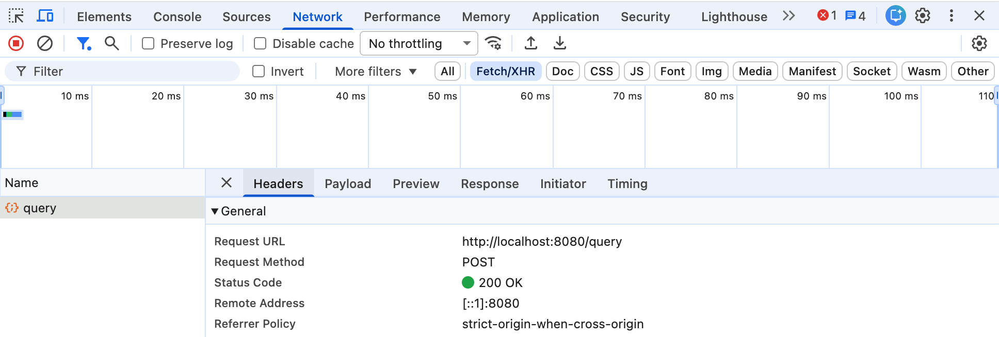

Today, I've been doing the [gqlgen tutorial](https://gqlgen.com/getting-started/). During the tutorial, I found that a GraphQL server receives a HTTP POST request even for a query operation.



After a minute, I understood it's natural because a GraphQL request may include request body like [variables](https://graphql.org/learn/queries/#variables). As the following result of the [hurl](https://hurl.dev/) command, we can query data using a HTTP POST request from GraphQL API.

```graphql
query GetTodos($ids: [ID!]!) {
  todos(ids: $ids) {
    id
    text
    done
  }
}

variables {
  "ids": ["T48"]
}
```

```shell
$ hurl --verbose find_todos.hurl
* ------------------------------------------------------------------------------
* Executing entry 1
*
* Cookie store:
*
* Request:
* POST http://localhost:8080/query
*
* Request can be run with the following curl command:
* curl --header 'Content-Type: application/json' --data '{"query":"query GetTodos($ids: [ID!]!) {\n  todos(ids: $ids) {\n    id\n    text\n    done\n  }\n}","variables":{"ids":["T48"]}}' 'http://localhost:8080/query'
*
> POST /query HTTP/1.1
> Host: localhost:8080
> Accept: */*
> Content-Type: application/json
> User-Agent: hurl/7.1.0
> Content-Length: 128
>
* Response: (received 75 bytes in 1 ms)
*
< HTTP/1.1 200 OK
< Content-Type: application/json
< Date: Sat, 01 Aug 2026 11:56:55 GMT
< Content-Length: 75
<
*
{
  "data": {
    "todos": [
      {
        "id": "T48",
        "text": "buy a cup of coffee",
        "done": false
      }
    ]
  }
}

```
