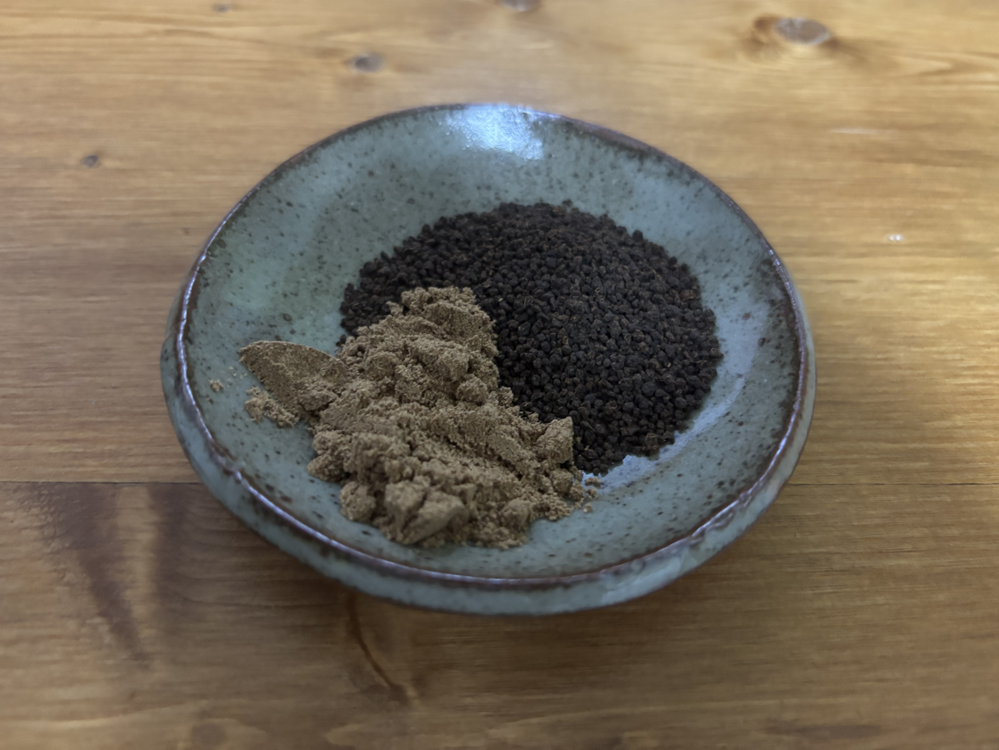
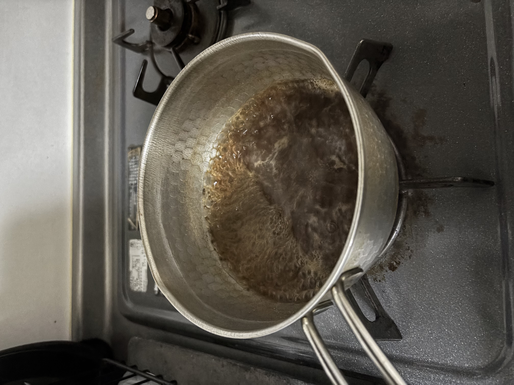
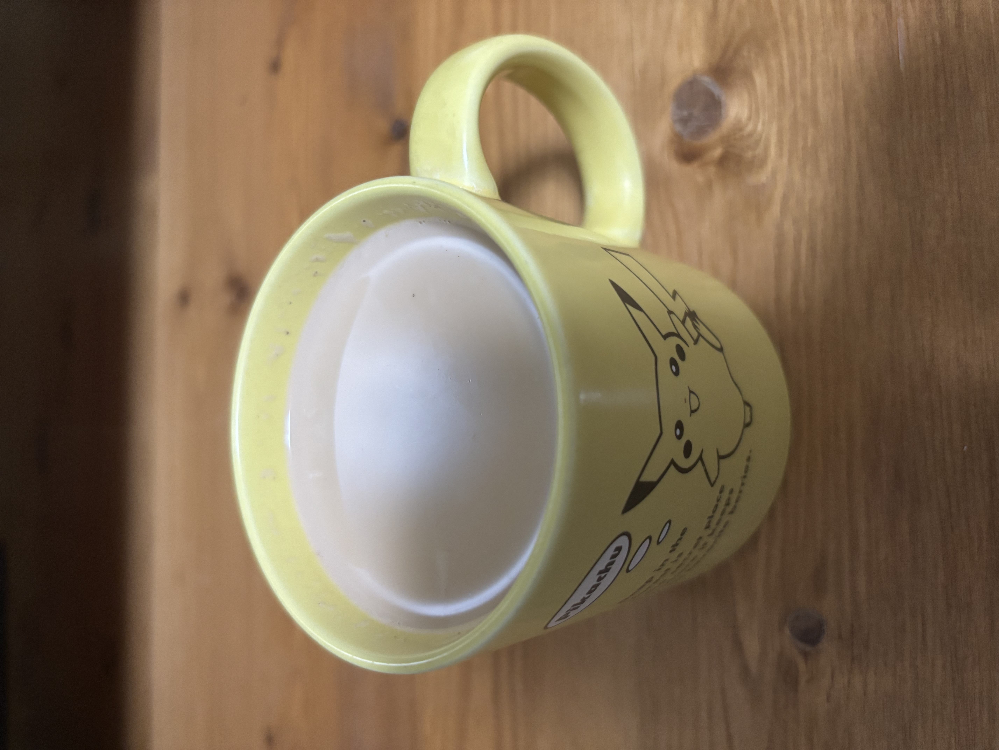

I often choose a cup of masala chai as a drink when eating at an Indian curry restaurant (lassi is also a good choice for me). Let's make it!

## Ingredients

- Two spoons of CTC Assam tea
- A spoon of chai masala
- 200 ml water
- 300 ml milk

## Method

1. Boil the water.
2. Add the assam tea and the chai masala to the water.
3. Wait for 2 minutes.
4. Add the milk to the water.
5. Turn off the heat after it boils.
6. Pour the masala chai into a cup through a tea strainer.
7. That's it!

## Photos

