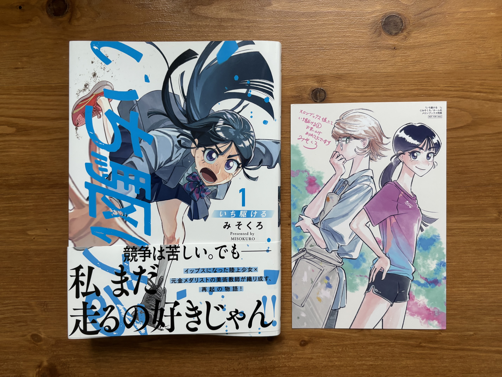

Throughout the stories, "michi", which means "a way", is often used to express where to go in life. Tamaki-sensei retired from being a runner, and she doesn't seem concerned about it on the surface. On the other hand, Ichi sticks to being a runner. I'm looking forward to seeing which "michi" each of them will choose.

## Photos

