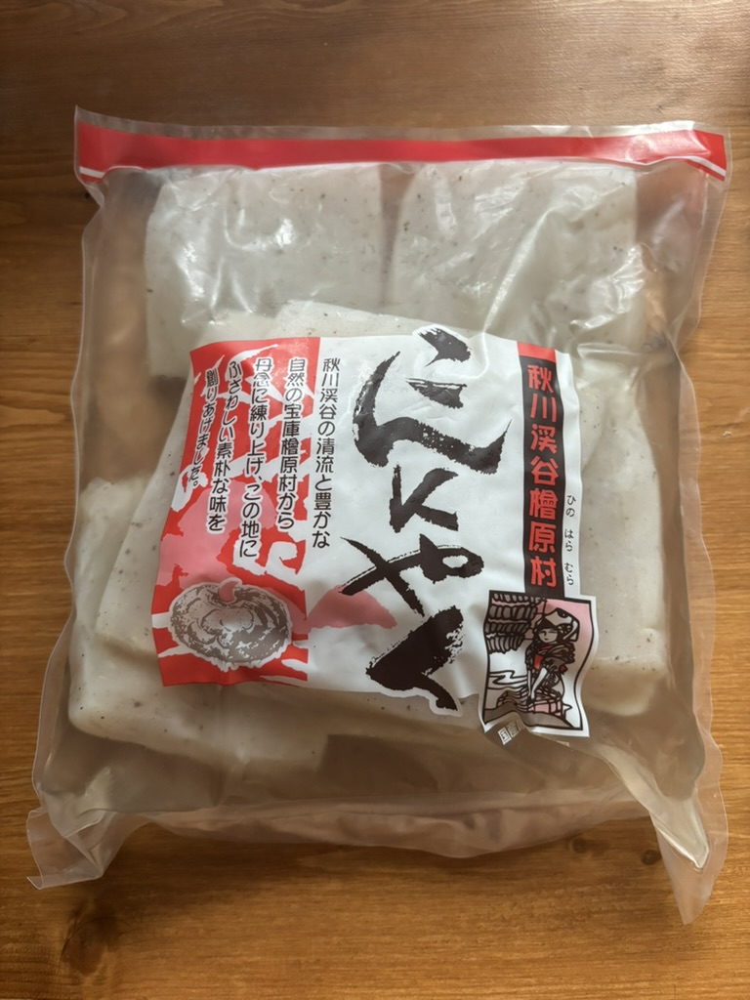
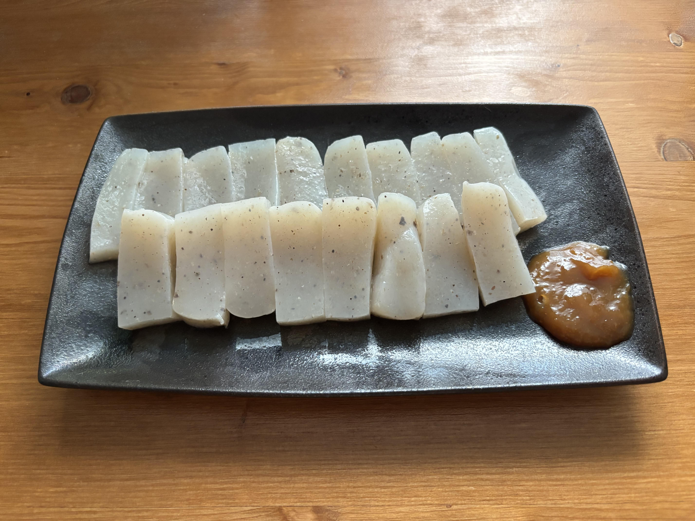

While shopping at the supermarket, I found my favorite konjac, which is made in Hinohara-mura. Its texture is slightly crunchy and I wondered hat makes it different from the ones I usually eat. According to the official site, this feature comes from a unique manufacturing method called "Bataneri". It takes a lot of effort, but it makes the konjac taste better.

https://tokyogrown.jp/node/1640329

## Photos

