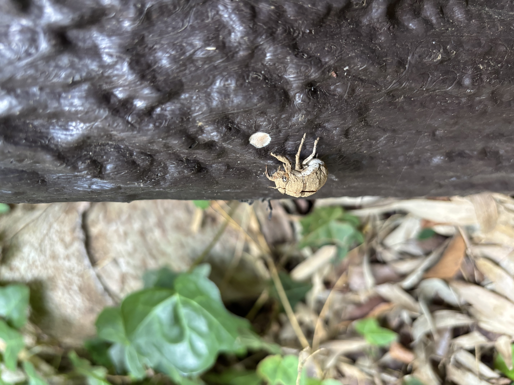
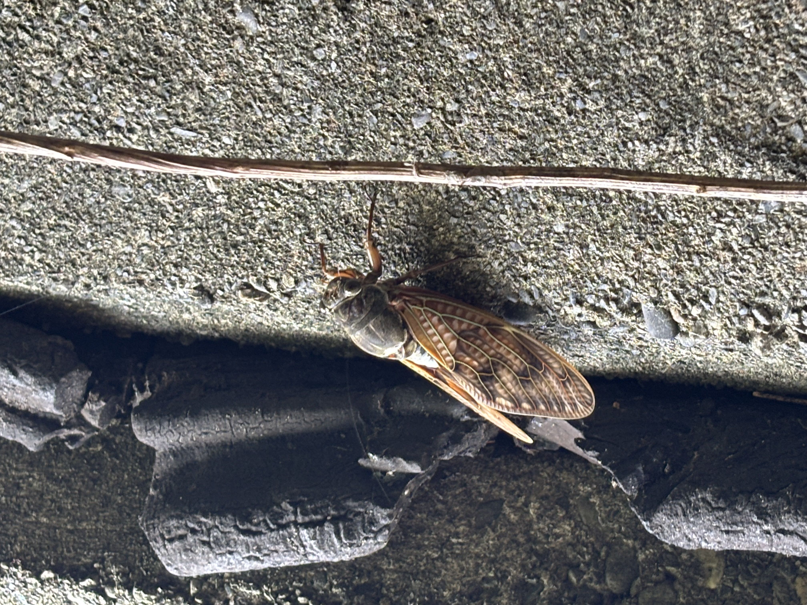

A few days ago, I walked around [Kozukue Castle Ruins](https://ja.wikipedia.org/wiki/%E5%B0%8F%E6%9C%BA%E5%9F%8E) in Kanagawa Prefecture. There were a lot of bamboo and sounds of cicadas. And I think I gave too much blood to mosquitoes.

## Photos

