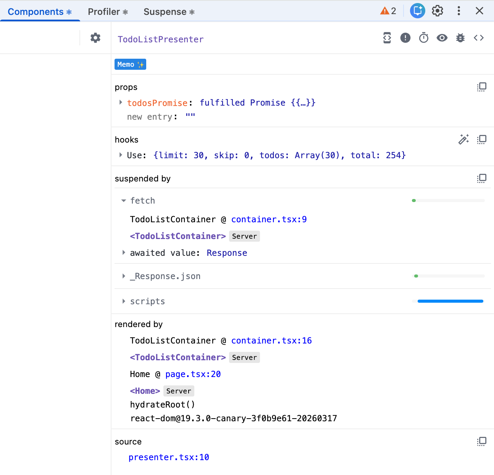

Learning the [use API](https://react.dev/reference/react/use#use-promise) with a Promise is a good way to understand how RSC and Suspense behave. Let's look at the example code below.

```tsx
// in todo-list/container.tsx
import { Suspense } from "react";
import { TodoListPresenter } from "./presenter";
import type { GetTodosResponse } from "@/features/todo/types/todo";

export function TodoListContainer() {
  const todosPromise = fetch("https://dummyjson.com/todos").then(
    (res) => res.json() as unknown as GetTodosResponse,
  );

  return (
    <Suspense fallback={<div>Loading...</div>}>
      <TodoListPresenter todosPromise={todosPromise} />
    </Suspense>
  );
}
```

```tsx
// in todo-list/presenter.tsx
"use client";

import { use } from "react";
import type { GetTodosResponse } from "@/features/todo/types/todo";

type Props = {
  todosPromise: Promise<GetTodosResponse>;
};
export function TodoListPresenter({ todosPromise }: Props) {
  const { todos: todoItems } = use(todosPromise);

  return (
    <ul>
      {todoItems.map((item) => (
        <li key={item.id}>{item.todo}</li>
      ))}
    </ul>
  );
}
```

While the Promise is pending, `<Suspense />` renders the fallback UI and React sends an RSC payload that contains an unresolved Promise from the server. Behind the scenes, the Promise is fulfilled on the client, and then `TodoListPresenter` can access the data and show the todo list. The payload looks like this:

```html
<script>
  self.__next_f.push([
    1,
    'a0:I["children":["$","$La0",null,{"todosPromise":"$@a1"}',
  ]);
</script>
```



If we use an async component and it waits for the Promise on the server, the RSC payload includes the todo list like this. That means React renders the todo list on the server, and no hydration happens on the client.

```html
<script>
  self.__next_f.push([
    1,
    'a1:{"todos":[{"id":1,"todo":"Do something nice for someone you care about","completed":false,"userId":152},{"id":2,"todo":"Memorize a poem","completed":true,"userId":13}',
  ]);
</script>
```

```tsx
import { Suspense } from "react";
import type { GetTodosResponse } from "@/features/todo/types/todo";

export function TodoList() {
  return (
    <Suspense fallback={<div>Loading...</div>}>
      <_TodoList />
    </Suspense>
  );
}

async function _TodoList() {
  const res = await fetch("https://dummyjson.com/todos");
  const { todos: todoItems } =
    (await res.json()) as unknown as GetTodosResponse;

  return (
    <ul>
      {todoItems.map((item) => (
        <li key={item.id}>{item.todo}</li>
      ))}
    </ul>
  );
}
```
